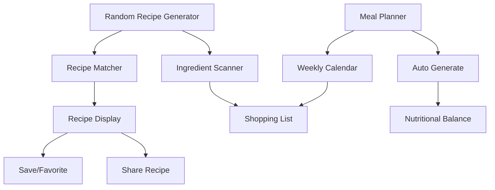
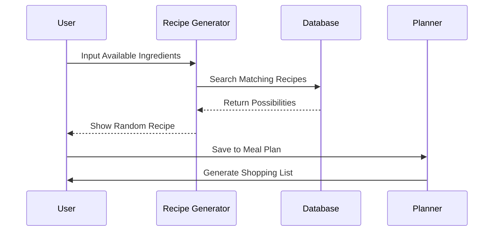

# Random Food Recipe Generator & Meal Planner

## Overview
A fun and practical web application that solves the daily "what should I cook?" dilemma by generating random recipe suggestions based on available ingredients and preferences. It includes a weekly meal planner and shopping list generator.

## Core Features

## User Flow

## Features in Detail

### 1. Recipe Generator
- Input available ingredients
- Dietary preferences (vegetarian, vegan, gluten-free)
- Cuisine type filter
- Cooking time preferences
- Difficulty level selection

### 2. Recipe Display
- Step-by-step instructions
- Ingredient quantities
- Cooking time
- Difficulty level
- Nutritional information
- Photos/illustrations
- Quick share buttons

### 3. Meal Planner
- Weekly calendar view
- Drag and drop interface
- Auto-generate balanced meal plans
- Save favorite combinations
- Export shopping list

### 4. Shopping List
- Auto-generate from meal plan
- Categorize by store sections
- Check off items
- Save frequent items
- Share list feature

## Technical Stack
- Frontend: Vanilla JavaScript, HTML5, CSS3
- Backend: Node.js with Express
- Storage: Local JSON storage (v1)
- Recipe Data: Custom JSON database
- API: RESTful architecture

## Development Phases

1. Phase 1 - Core Features
   - Basic recipe database
   - Random recipe generator
   - Simple ingredient matching
   - Basic UI/UX

2. Phase 2 - Enhancement
   - Meal planner implementation
   - Shopping list generator
   - Recipe saving/favoriting
   - Sharing functionality

3. Phase 3 - Polish
   - UI/UX improvements
   - Performance optimization
   - Mobile responsiveness
   - Offline capability

## Success Criteria
- Generate recipes in under 2 seconds
- Support at least 100 base recipes
- Work offline after initial load
- Mobile-friendly interface
- Easy one-click sharing

## Future Enhancements
1. Recipe image upload
2. Community recipe sharing
3. AI-powered recipe suggestions
4. Integration with grocery delivery services
5. Dietary tracking and analytics

The app should be fun, fast, and solve a real daily problem while maintaining simplicity and ease of use.