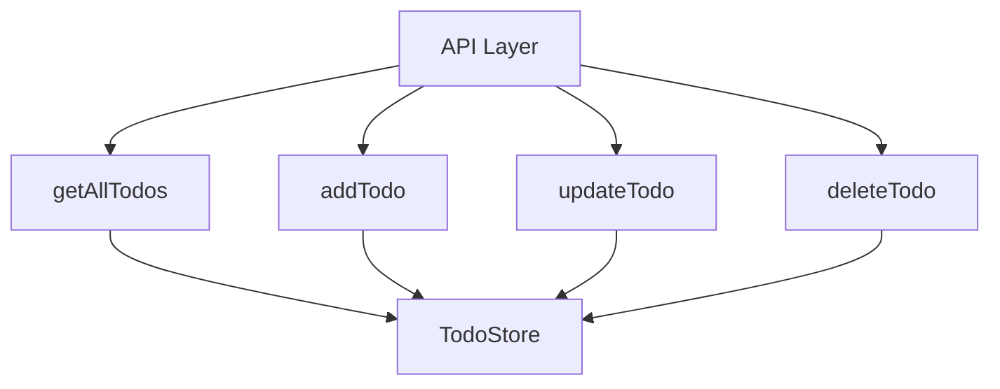

# Todo API Documentation

## API Endpoints



## Endpoint Details

### GET /api/todos
Retrieves all todos from the store.

**Response:**
```json
[
  {
    "id": 1,
    "text": "Sample todo",
    "completed": false,
    "createdAt": "2024-03-06T12:00:00.000Z"
  }
]
```

### POST /api/todos
Creates a new todo item.

**Request Body:**
```json
{
  "text": "New todo item"
}
```

**Response:** Created todo object

### PUT /api/todos/:id
Updates an existing todo.

**Request Body:**
```json
{
  "completed": true
}
```

**Response:** Updated todo object

### DELETE /api/todos/:id
Deletes a todo item.

**Response:** 204 No Content