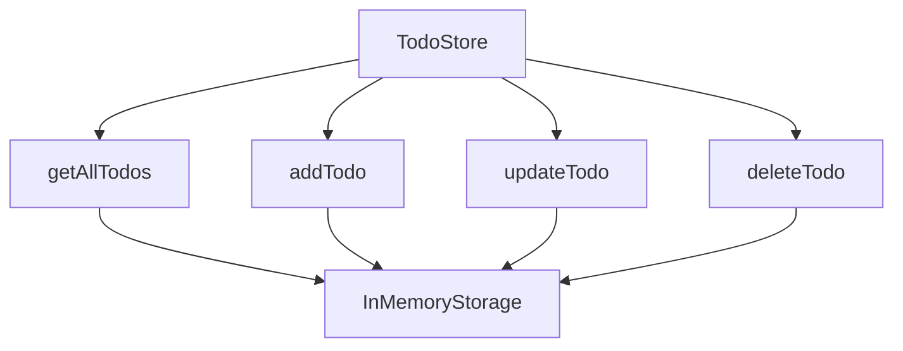
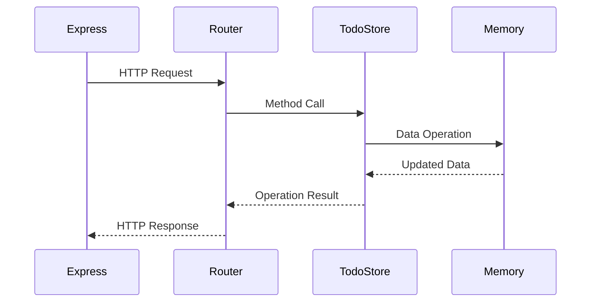

# Backend Documentation

## Store Architecture

## Data Flow

## Store Implementation Details

### Constructor
- Initializes empty todos array
- Sets up ID counter for unique todo IDs

### Methods
- `getAllTodos`: Returns complete todos array
- `addTodo`: Creates new todo with:
  - Unique ID
  - Text content
  - Completed status (false)
  - Creation timestamp
- `updateTodo`: Modifies existing todo
  - Finds by ID
  - Applies partial updates
- `deleteTodo`: Removes todo by ID
  - Returns success status

## Express Server Configuration

### Middleware
- CORS enabled for frontend access
- JSON body parsing
- Static file serving

### Error Handling
- 400: Bad Request (invalid input)
- 404: Not Found (invalid todo ID)
- 204: Successful Deletion

## Security Considerations
- Input validation on todo text
- ID parameter sanitization
- CORS configuration
- Error message sanitization