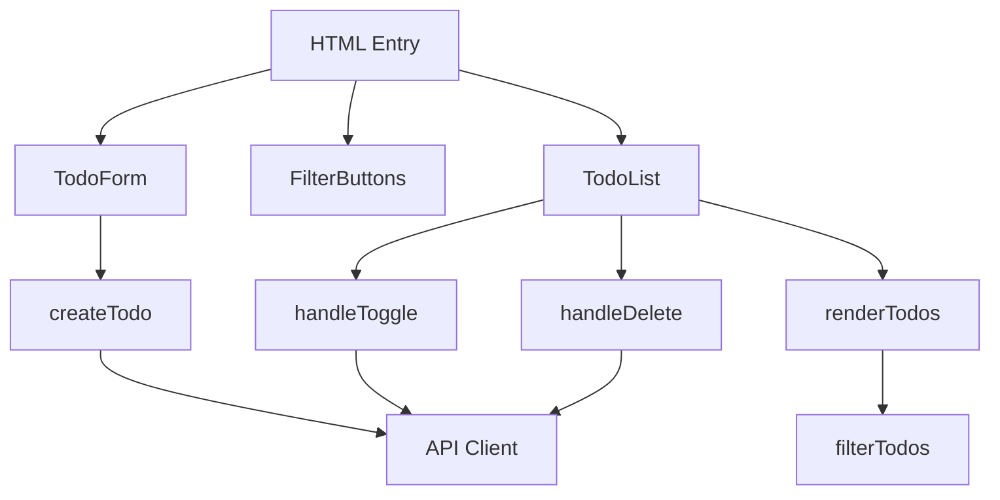
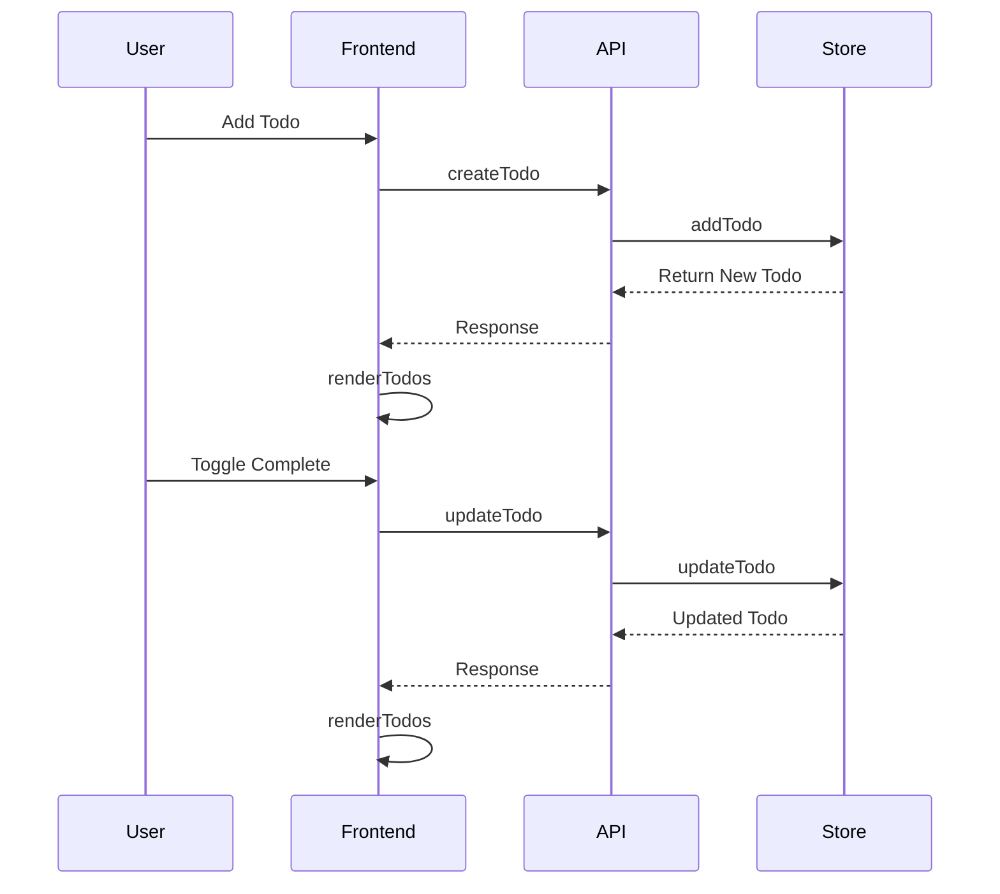

# Frontend Documentation

## Architecture Overview

## Component Flow

## Function Documentation

### API Functions
- `fetchTodos`: Retrieves all todos from the API
- `createTodo`: Sends POST request to create new todo
- `updateTodo`: Updates existing todo status
- `deleteTodo`: Removes todo from the system

### UI Functions
- `renderTodos`: Renders todo list based on current filter
- `filterTodos`: Filters todos by status (all/active/completed)

### Event Handlers
- `handleToggle`: Toggles todo completion status
- `handleDelete`: Triggers todo deletion
- Form submit handler: Creates new todos
- Filter click handler: Updates visible todos

## State Management
The frontend maintains two main states:
1. `todos`: Array of all todo items
2. `currentFilter`: Current active filter selection

## CSS Structure
- Container layout and responsiveness
- Todo item styling and interactions
- Filter button states
- Form input styling
- Accessibility considerations