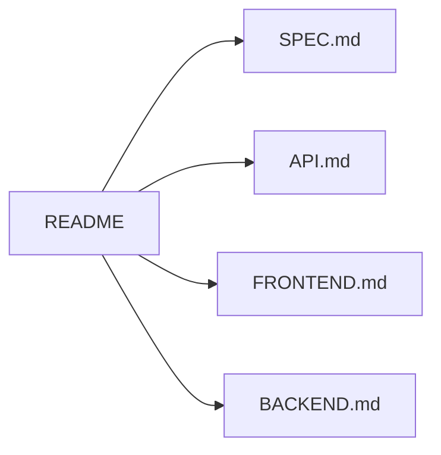
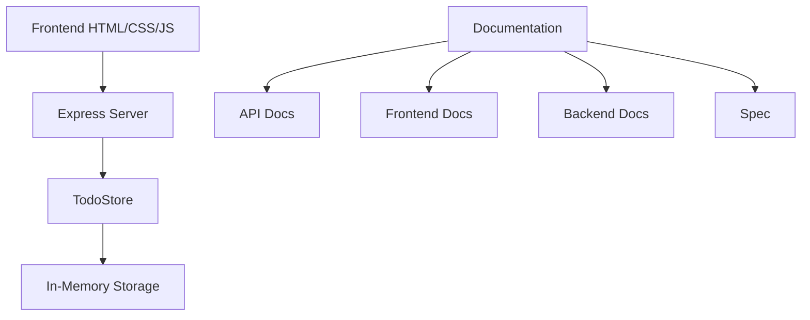

# Todo App Documentation

## Overview
This documentation covers all aspects of the minimalist todo application built with vanilla JavaScript, HTML, CSS frontend and Node.js backend.

## Documentation Structure

## Quick Links
- [Project Specification](./SPEC.md)
- [API Documentation](./API.md)
- [Frontend Documentation](./FRONTEND.md)
- [Backend Documentation](./BACKEND.md)

## Getting Started

### Installation
1. Navigate to the backend directory
2. Run `npm install`
3. Start the server with `node server.js`
4. Access the application at `http://localhost:3000`

## Architecture Overview

## Tech Stack
- Frontend: Vanilla JavaScript, HTML5, CSS3
- Backend: Node.js, Express
- Storage: In-memory JavaScript array
- Documentation: Markdown with Mermaid diagrams

## Development Workflow
1. Check SPEC.md for requirements
2. Reference appropriate documentation section
3. Make changes following the documented patterns
4. Test using the documented API endpoints