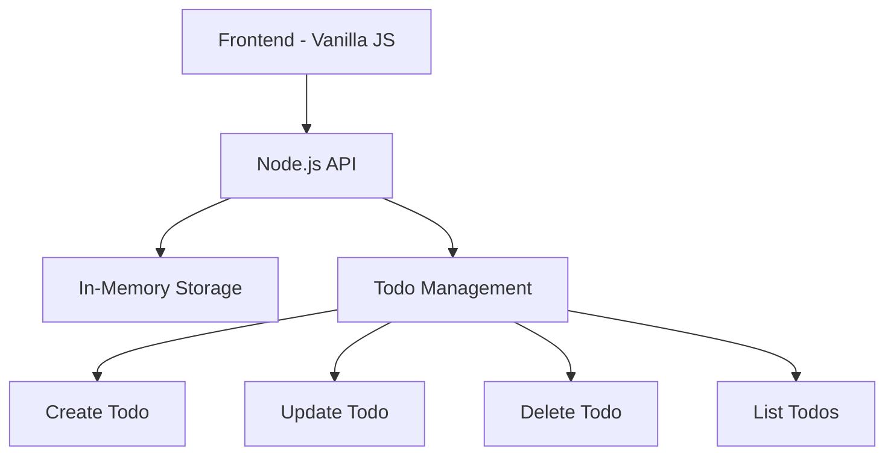
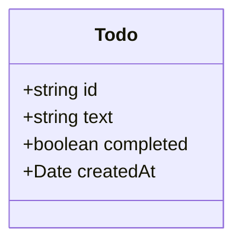
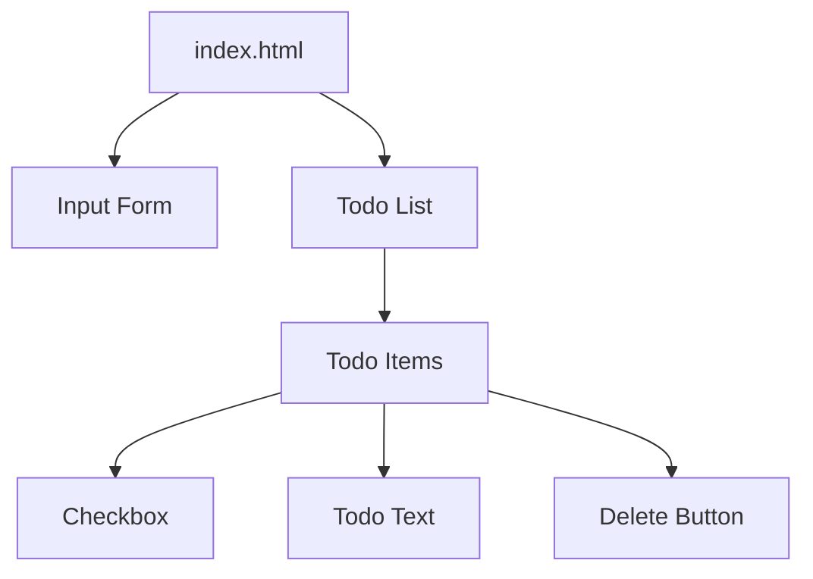

# Todo App Specification

## Overview
A minimalist todo application built with vanilla JavaScript, HTML, and CSS for the frontend, and a simple Node.js API with in-memory storage.

## Core Features
1. Create new todo items
2. Mark todos as complete/incomplete
3. Delete todo items
4. List all todos
5. Filter todos by status (All/Active/Completed)

## Technical Architecture



## Data Model



## User Interface Design


## Project Structure
```
├── frontend/
│   ├── index.html
│   ├── styles.css
│   └── script.js
└── backend/
    ├── server.js
    └── todoStore.js
```

## Component Structure
- App (Main container)
  - TodoInput (Form to add new todos)
  - TodoList (Container for todo items)
    - TodoItem (Individual todo component)
  - FilterButtons (All/Active/Completed)

## User Stories
1. As a user, I want to add a new todo item so that I can remember tasks
2. As a user, I want to mark a todo as complete so that I can track my progress
3. As a user, I want to delete a todo so that I can remove unnecessary tasks
4. As a user, I want to see all my todos so that I can review my tasks
5. As a user, I want to filter todos by status so that I can focus on specific tasks

## Technical Requirements
- Frontend:
  - Pure HTML, CSS, and JavaScript
  - No external frontend libraries/frameworks
  - Fetch API for making HTTP requests
- Backend:
  - Node.js for API server
  - Express.js for routing
  - In-memory data storage (Array/Object)
  - Basic REST API endpoints

## API Endpoints
- GET /api/todos - Get all todos
- POST /api/todos - Create a new todo
- PUT /api/todos/:id - Update a todo
- DELETE /api/todos/:id - Delete a todo

## Future Enhancements (v2)
1. Persist data in a file or database
2. Add due dates
3. Add categories
4. Add search functionality
5. Add sort functionality

## Development Phases

1. Phase 1 - Core Features
   - Basic HTML structure and styling
   - Node.js API setup with in-memory storage
   - Frontend-backend integration
   - Basic CRUD operations

2. Phase 2 - Enhancement
   - Improved error handling
   - Basic input validation
   - Simple animations
   - Responsive design

3. Phase 3 - Testing
   - Manual testing
   - Basic API testing
   - Browser compatibility testing

## Success Criteria
- All CRUD operations work correctly
- Frontend successfully communicates with the API
- Interface is clean and intuitive
- Application works without any major bugs